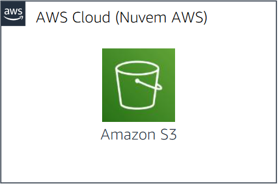
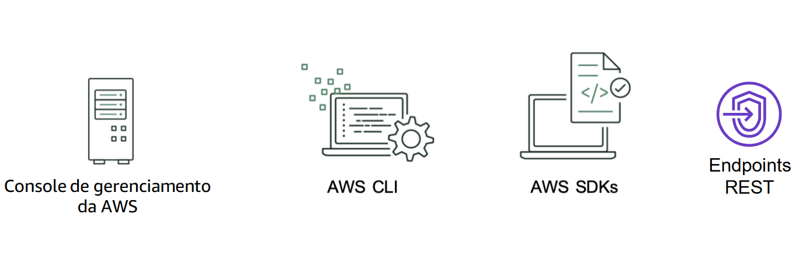
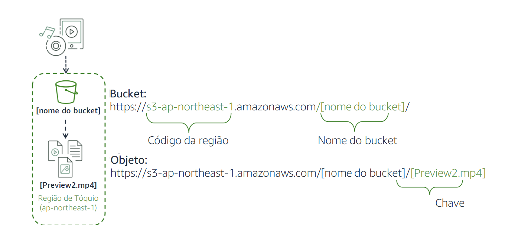
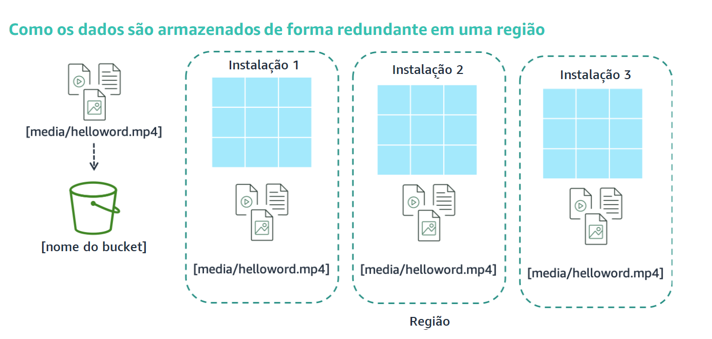
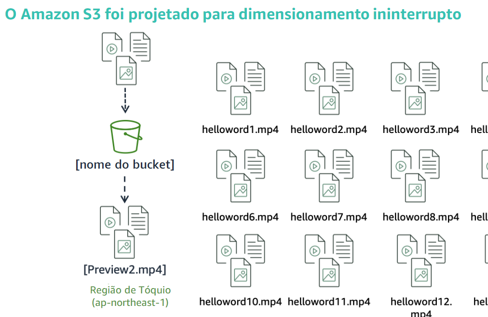
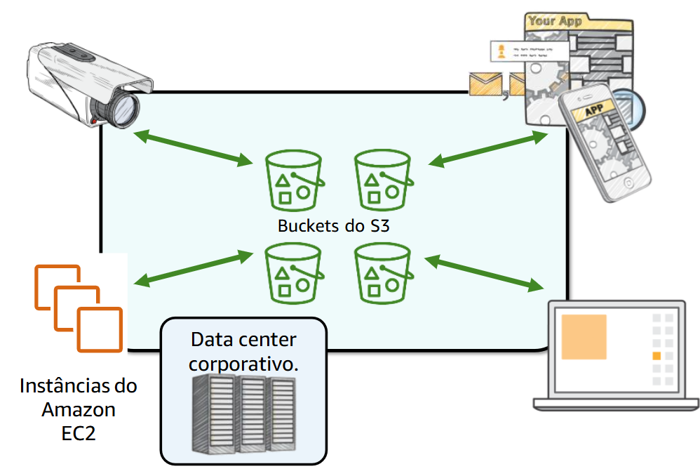

# 🌩️ Amazon Simple Storage Service (Amazon S3) 🌩️

### 🚀 Solução gerenciada de armazenamento na nuvem

- Os dados são armazenados como **objetos** em **buckets**
- Armazenamento **praticamente ilimitado** – um único objeto pode ter até **5 TB**
- **Alta durabilidade** – projetado para **11 noves (99,999999999%)**
- Controle **granular** de acesso a buckets e objetos

---

## 🏗️ O que são **Buckets** e para que servem?

Os **buckets** são **contêineres lógicos** que armazenam objetos no Amazon S3.  
Com eles, você pode:  
✔️ **Definir permissões** para controlar quem pode criar, excluir e listar objetos  
✔️ **Organizar os dados** de forma eficiente  
✔️ **Acessar globalmente** via URLs

## 📂 O que são **Objetos** e para que servem?

Os **objetos** são os arquivos armazenados dentro de um bucket, como:  
📄 **Documentos**  
🖼️ **Imagens**  
📹 **Vídeos**

Cada objeto tem um nome único chamado **chave de objeto**. Para modificar um objeto, é necessário **substituir o arquivo completo** no bucket.

---

## 🛠️ Recursos do Amazon S3

✅ **Armazenamento escalável** e **redundante**  
✅ **Criptografia** para proteger os dados  
✅ **Recuperação de dados** em qualquer lugar e a qualquer momento  
✅ **Nomes de buckets exclusivos** globalmente

---

## 🏷️ Classes de armazenamento do Amazon S3

| Classe                      | Uso recomendado                                                                  |
| --------------------------- | -------------------------------------------------------------------------------- |
| **S3 Standard**             | Dados acessados com frequência                                                   |
| **S3 Intelligent-Tiering**  | Otimiza custos movendo objetos automaticamente entre camadas                     |
| **S3 Standard-IA**          | Dados acessados com menos frequência, mas que exigem acesso rápido               |
| **S3 One Zone-IA**          | Dados raramente acessados e armazenados em **uma única zona de disponibilidade** |
| **S3 Glacier**              | Arquivamento de longo prazo, com recuperação de minutos a horas                  |
| **S3 Glacier Deep Archive** | Armazenamento **ultra econômico** para retenção de longo prazo                   |

---

## 🌍 Acesse seus dados de qualquer lugar

Cada objeto recebe um URL exclusivo para acesso, baseado no nome do bucket e da região AWS escolhida.

---

## 🔗 Estrutura de URL no Amazon S3

**Exemplo:**

O Amazon S3 foi usado para criar um bucket na Região Tóquio, que é identificada na AWS formalmente por seu código de Região: ap-northeast-1.

Mostra como o URL de um bucket é estruturado. O código da Região é o primeiro, seguido poramazonaws.come pelo nome do bucket.O Amazon S3 se refere a arquivos como objetos. Assim que você tiver um bucket, poderá armazenar praticamente qualquer número de objetos nele. Um objeto é composto por dados e quaisquer metadados que descrevam o arquivo. Para armazenar um objeto no Amazon S3, você carrega o arquivo que deseja armazenar em um bucket. Ao carregar um arquivo, é possível definir permissões (e metadados) nos dados. Nesse exemplo, o objeto Preview2.mp4 é armazenado no bucket. A URL do arquivo inclui o nome do objeto no final.

O Amazon S3 permite armazenar objetos e acessá-los via URLs estruturadas.

---

## 📀 Redundância no Amazon S3

Os dados armazenados no S3 são **replicados automaticamente** em múltiplas instalações dentro da mesma **Região AWS**, garantindo alta disponibilidade e durabilidade.

---

## 📈 Dimensionamento automático

✔️ O S3 **se ajusta automaticamente** conforme sua necessidade aumenta  
✔️ Nenhuma configuração manual é necessária  
✔️ Você paga **apenas pelo que usa**

---

## 🎯 Casos de uso comuns do Amazon S3

🔹 **Armazenamento de ativos de aplicativos**  
🔹 **Hospedagem de sites estáticos**  
🔹 **Backup e recuperação de desastres**  
🔹 **Armazém de dados para Big Data**  
🔹 **E muito mais...**

O Amazon S3 é flexível e pode ser usado para armazenar **qualquer quantidade de dados**, acessível **de qualquer lugar**.

---

🚀 **Pronto para começar?** Explore as soluções da AWS e aproveite todo o potencial do Amazon S3!
